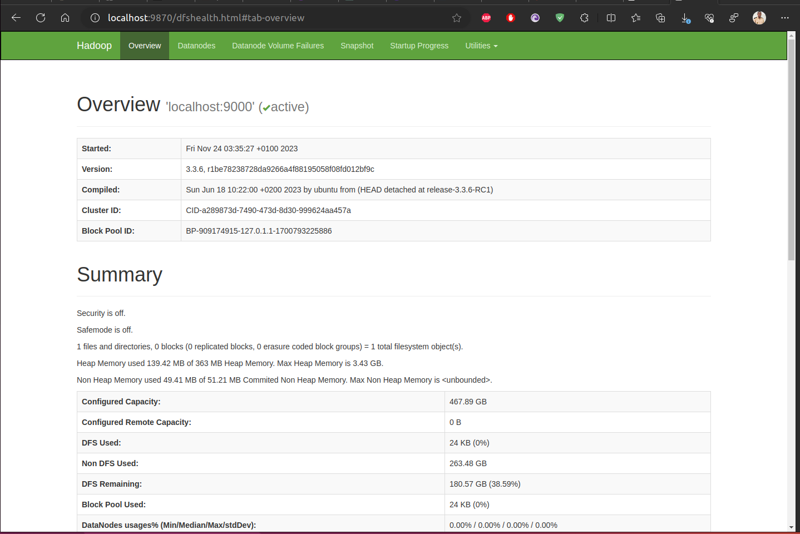
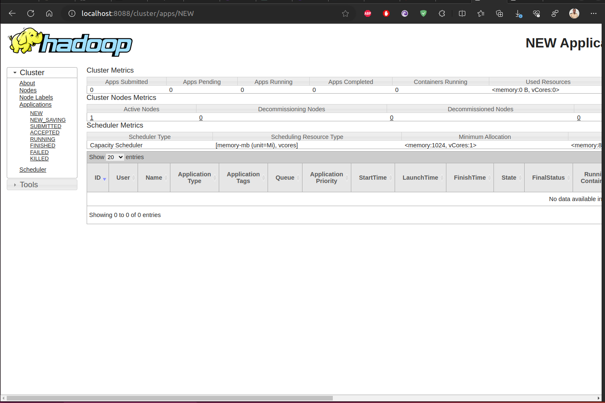

# Setting Up a Single-Node Hadoop Cluster on Ubuntu and Do some stuff on it

## Part 1: setup

Installing Hadoop on Ubuntu involves several steps. Before you start, ensure that your system meets the necessary prerequisites like having a Java Development Kit (JDK) installed, as Hadoop is built using Java. Here's a step-by-step guide to install Hadoop in a pseudo-distributed mode, which is a common setup for development and testing:

### Prerequisites

1. **Java Installation**: Hadoop requires Java to be installed on your system. You can install Java using the following command:

   ```bash
   sudo apt update
   sudo apt install openjdk-8-jdk
   ```

2. **Verify Java Installation**: Check the Java version to confirm the installation:

   ```bash
   java -version
   ```

### Installing Hadoop

1. **Download Hadoop**:
   - First, go to the [Apache Hadoop Releases](https://hadoop.apache.org/releases.html) page and find the URL for the binary you wish to download.
   - Use `wget` to download Hadoop. Replace the URL with the one you found for the version you want to install:

     ```bash
     # for example for the latest version (3.2.4)
     wget https://dlcdn.apache.org/hadoop/common/hadoop-3.2.4/hadoop-3.2.4.tar.gz 
     ```

2. **Extract Hadoop**:
   - Extract the downloaded archive:

     ```bash
     tar -xzvf hadoop-3.2.4.tar.gz
     ```

   - Move the extracted directory to a location of your choice, for example, `/usr/local/hadoop`:

     ```bash
     sudo mv hadoop-3.2.4/ /usr/local/hadoop
     ```

3. **Configure Hadoop Environment**:
   - Open your `.bashrc` file:

     ```bash
     nano ~/.bashrc
     ```

   - Add the following lines at the end of the file to set up Hadoop environment variables (replace `/usr/local/hadoop` with your Hadoop installation directory if different):

     ```bash
     export HADOOP_HOME=/usr/local/hadoop
     export PATH=$PATH:$HADOOP_HOME/bin
     export PATH=$PATH:$HADOOP_HOME/sbin
     export HADOOP_MAPRED_HOME=$HADOOP_HOME
     export HADOOP_COMMON_HOME=$HADOOP_HOME
     export HADOOP_HDFS_HOME=$HADOOP_HOME
     export YARN_HOME=$HADOOP_HOME
     ```

   - Apply the changes:

     ```bash
     source ~/.bashrc
     ```

4. **Configure Hadoop Files**:
   - You need to edit several configuration files in the `$HADOOP_HOME/etc/hadoop` directory:
     - `hadoop-env.sh`
     - `core-site.xml`
     - `hdfs-site.xml`
     - `mapred-site.xml`
     - `yarn-site.xml`

Setting up a basic configuration for Hadoop in pseudo-distributed mode involves editing several configuration files in the `$HADOOP_HOME/etc/hadoop` directory.

- setup the `hadoop-env.sh`

This file sets up the environment variables used by Hadoop. The primary variable to set here is the Java installation path.

Edit the file:

```bash
nano $HADOOP_HOME/etc/hadoop/hadoop-env.sh
```

Find the line that sets `JAVA_HOME`, and modify it to your Java installation path:

```bash
export JAVA_HOME=/usr/lib/jvm/java-8-openjdk-amd64
```

Replace `/usr/lib/jvm/java-8-openjdk-amd64` with the path to your Java installation.

- setup the `core-site.xml`

This file contains settings related to I/O settings that are common to HDFS and MapReduce.

Edit the file:

```bash
nano $HADOOP_HOME/etc/hadoop/core-site.xml
```

Add the following configuration between the `<configuration>` tags:

```xml
<configuration>
    <property>
        <name>fs.defaultFS</name>
        <value>hdfs://localhost:9000</value>
    </property>
</configuration>
```

- setup the `hdfs-site.xml`

This file is used to configure HDFS settings.

Edit the file:

```bash
nano $HADOOP_HOME/etc/hadoop/hdfs-site.xml
```

Add the following configuration between the `<configuration>` tags:

```xml
<configuration>
    <property>
        <name>dfs.replication</name>
        <value>1</value>
    </property>
    <property>
        <name>dfs.namenode.name.dir</name>
        <value>file:/usr/local/hadoop/data/namenode</value>
    </property>
    <property>
        <name>dfs.datanode.data.dir</name>
        <value>file:/usr/local/hadoop/data/datanode</value>
    </property>
</configuration>
```

Make sure to create the directories for namenode and datanode if they don't exist.

- setup the `mapred-site.xml`

This file configures settings for MapReduce jobs.

First, create the file by copying from the template:

```bash
cp $HADOOP_HOME/etc/hadoop/mapred-site.xml.template $HADOOP_HOME/etc/hadoop/mapred-site.xml
```

Then, edit the file:

```bash
nano $HADOOP_HOME/etc/hadoop/mapred-site.xml
```

Add the following configuration between the `<configuration>` tags:

```xml
<configuration>
    <property>
        <name>mapreduce.framework.name</name>
        <value>yarn</value>
    </property>
</configuration>
```

- setup the `yarn-site.xml`

This file is for configuring YARN, the resource manager.

Edit the file:

```bash
nano $HADOOP_HOME/etc/hadoop/yarn-site.xml
```

Add the following configuration between the `<configuration>` tags:

```xml
<configuration>
    <property>
        <name>yarn.nodemanager.aux-services</name>
        <value>mapreduce_shuffle</value>
    </property>
    <property>
        <name>yarn.nodemanager.aux-services.mapreduce.shuffle.class</name>
        <value>org.apache.hadoop.mapred.ShuffleHandler</value>
    </property>
</configuration>
```


5. **Format the Hadoop Filesystem**:
   - Before starting Hadoop for the first time, you need to format the Hadoop filesystem:

     ```bash
     hdfs namenode -format
     ```

6. **Start Hadoop**:
   - Start Hadoop services using the following command:

     ```bash
     start-dfs.sh
     start-yarn.sh
     ```

7. **Verify Installation**:
   - You can verify the installation by checking the Hadoop services status or by accessing the Hadoop web interface on your local machine (usually available on port 9870 for the NameNode UI).

   - You can verify the resource manager UI at 8088. Should look like:

### Note
- This installation is for a pseudo-distributed mode, where Hadoop is running on a single node simulating a cluster.
- Ensure that your firewall settings allow access to the required ports.
- For a fully distributed setup or for advanced configurations, additional steps and configurations are necessary.

It's highly recommended to refer to the official [Hadoop documentation](https://hadoop.apache.org/) or specific tutorials for detailed instructions and troubleshooting. The setup process can vary depending on the version of Hadoop and Ubuntu.

## Part 2: DO your stuff

For example say you want to store your parquet files in your simple Hadoop cluster.

Since Hadoop uses the HDFS (Hadoop Distributed File System) for storage, you'll need to move your Parquet file from your local filesystem to HDFS. 
Here's a basic guide on how to do this:


### 1. Ensure Hadoop Services are Running

Before you start, make sure that your Hadoop cluster is up and running. This includes the HDFS services. You can start them using the `start-dfs.sh` script if they are not already running.

### 2. Locate Your Parquet File

Identify the Parquet file on your local system that you want to store in the cluster. Make sure you know its path. For example, it could be something like `../data/US_state_weather.parquet` the one we are using in notebook 1.

### 3. Create a Directory in HDFS

You might want to organize your files in HDFS by creating directories. To create a directory in HDFS, use:

```bash
hdfs dfs -mkdir /path/to/hdfs/directory
```

For example, to create a directory named `parquet_files`, you would use:

```bash
hdfs dfs -mkdir /parquet_files
```

### 4. Copy the Parquet File to HDFS

To copy the Parquet file from your local filesystem to HDFS, use the `hdfs dfs -put` command. For example:


If you're copying it to the `parquet_files` directory you just created, the command would be:

```bash
hdfs dfs -put ../data/US_state_weather.parquet /parquet_files
```

### 5. Verify the File Transfer

After copying the file, you can check if the file is indeed in HDFS by listing the contents of the directory:

```bash
hdfs dfs -ls /parquet_files

# You should get something like this
Found 1 items
drwxr-xr-x   - abdou supergroup          0 2023-11-24 04:15 /parquet_files/US_state_weather.parquet
```

### Additional Information

- **File Sizes**: HDFS is optimized for large files. If your Parquet file is particularly large, HDFS is a suitable storage solution.

- **File Access**: Remember that once your file is in HDFS, you'll need to use Hadoop's tools and APIs to access and process the data.

- **Parquet Tools**: If you need to interact with Parquet files (e.g., read, write, inspect), you might need specific tools or libraries compatible with Hadoop and Parquet, such as Apache Spark or Apache Drill.

- **Data Processing**: For processing the data within the Parquet file, you can use tools like Apache Hive or Apache Spark, which integrate well with Hadoop and are capable of reading and writing Parquet files efficiently.

